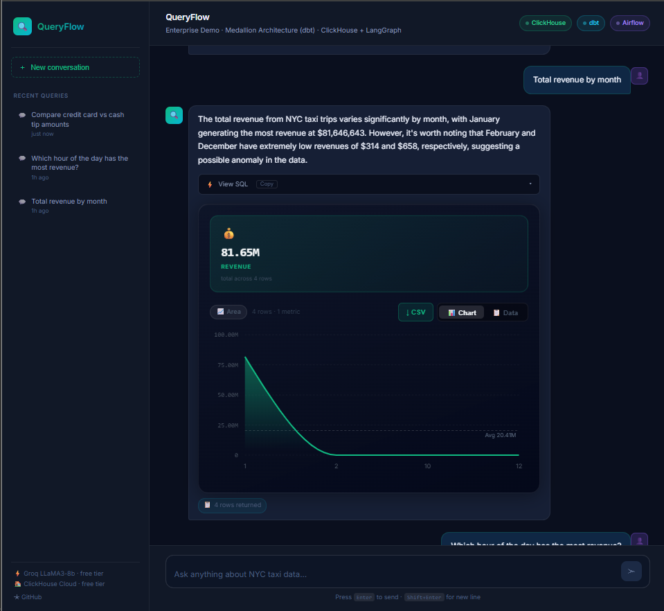
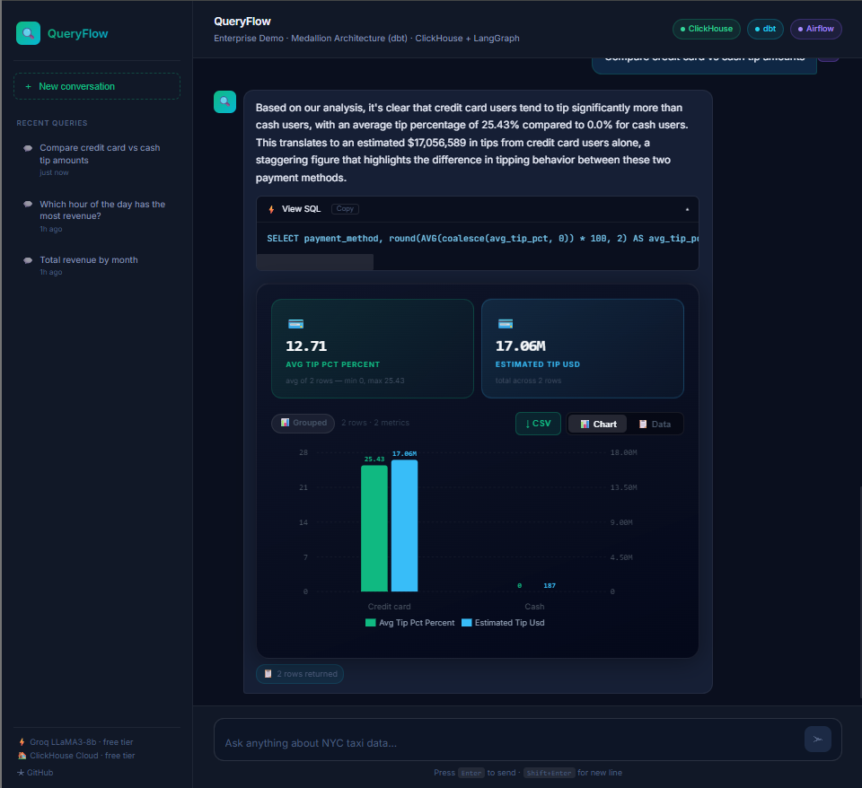
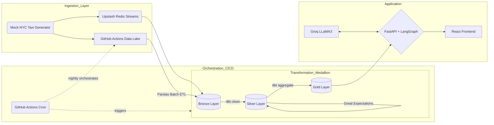

# QueryFlow: Enterprise Data Architecture 🚀

  
  

**QueryFlow** is an enterprise-grade Conversational Analytics platform and a complete demonstration of the modern data stack (GitHub Actions Data Lake → Upstash Redis Streams → Pandas ETL → dbt → Great Expectations → ClickHouse Cloud → Groq LLaMA3 → LangGraph). 

Users can ask plain English questions about millions of rows of NYC Taxi data. The LangGraph AI agent writes ClickHouse SQL, auto-corrects itself, and renders a stunning Power BI / Domo-style React dashboard.

---

## 🌟 Key Architectural Highlights

Most portfolio projects are simple CRUD apps connected to a static database. **QueryFlow is a complete, self-healing cloud data ecosystem.**

1. **Self-Healing AI (LangGraph State Machine):** Instead of crashing when bad SQL is generated, the agent catches ClickHouse database errors, feeds them back into the LLM, and *auto-corrects its own code* before the user ever sees it.
2. **Serverless Real-Time Streaming & Orchestration:** Features a live Python streaming script pumping real-time events into **Upstash Redis Streams**, combined with a **GitHub Actions Nightly Cron Pipeline** that extracts, cleanses, tests, and transforms batch data completely serverless.
3. **SSE Token Streaming Architecture:** High-performance FastAPI backend streams the AI's thoughts, SQL queries, and answers to the frontend *word-by-word* in real-time, matching ChatGPT's premium UX.
4. **Data-Driven Visualization Algorithm:** The React frontend automatically analyzes the shape of the ClickHouse result set and intelligently selects the best chart type (Area, Donut, Grouped Bar) to render.

---

## 🏗️ Enterprise Architecture 

This repository models the entire lifecycle of a Enterprise Data Engineering pipeline.

### 1. CI/CD & Orchestration (GitHub Actions)
- **GitHub Actions** (`.github/workflows/nightly-pipeline.yml`): Continuous Integration pipeline and full Nightly Orchestrator replacing Airflow. Runs data quality tests, Pandas ETL, and dbt models automatically every night.

### 2. Data Engineering (Redis, Pandas, dbt, Data Lake)
- **Streaming & Batch**: `scripts/stream_producer.py` streams real-time events to **Upstash Redis Streams**. `scripts/batch_etl.py` runs Pandas batch processes and saves files to a **GitHub Actions Artifact Data Lake**.
- **dbt (Data Build Tool)** (`dbt/`): ELT Medallion Architecture mapping raw (Bronze) to clean (Silver) to aggregated (Gold). Runs natively against ClickHouse Cloud.
- **Data Observability**: `tests/data_quality.py` implements *Great Expectations* validation logic, preventing bad data from hitting the Gold layer.

### 3. AI & Application Layer
- **LangGraph State Machine**: A cyclical text-to-SQL agent that catches ClickHouse errors and *auto-corrects* itself.
- **React Frontend**: A stunning, dark-mode BI interface deployed on Vercel.

---

## 🚀 Quick Start (Deployment)

This project is designed for modern serverless deployment:
- **Frontend (Vercel)**: Optimized for edge deployment.
- **Backend (Render)**: Hosted FastAPI microservice.

To run locally:
1. `cd backend && uvicorn main:app --reload`
2. `cd frontend && npm run dev`
