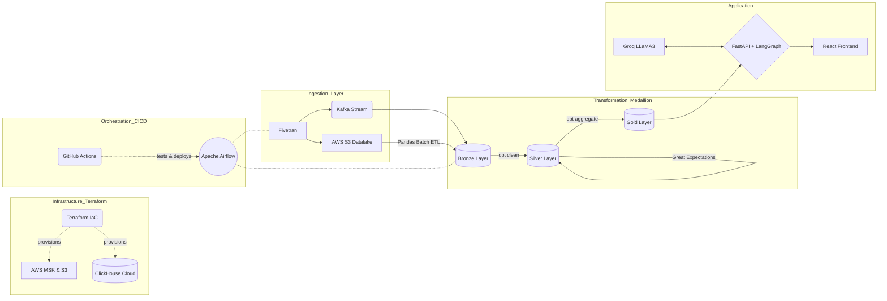

# QueryFlow: Top 1% Enterprise Data Architecture 🚀

**QueryFlow** is an enterprise-grade Conversational Analytics platform and a complete demonstration of the modern data stack (Terraform → Fivetran → Kafka → Airflow → dbt → Great Expectations → ClickHouse → LangGraph). 

Users can ask plain English questions about millions of rows of NYC Taxi data. The LangGraph AI agent writes ClickHouse SQL, auto-corrects itself, and renders a stunning Power BI / Domo-style React dashboard.

---

## 🏗️ Enterprise Architecture 

This repository models the entire lifecycle of a Top 1% Data Engineering pipeline.

### 1. Cloud Infrastructure (Terraform)
- **`infra/main.tf`**: Provisions AWS MSK for Kafka streaming, S3 for the Data Lake, and ClickHouse Cloud using Infrastructure as Code (IaC).

### 2. CI/CD & Orchestration (GitHub Actions & Airflow)
- **GitHub Actions** (`.github/workflows/ci-cd.yml`): Continuous Integration pipeline running Python linting, tests, and deployment.
- **Apache Airflow** (`dags/`): Automated DAGs coordinating Fivetran syncs and dbt builds.

### 3. Data Engineering (Kafka, Pandas, dbt, Great Expectations)
- **Streaming & Batch**: `scripts/kafka_producer.py` and `scripts/batch_etl.py` ingest data in real-time and via Pandas batch processes.
- **dbt (Data Build Tool)** (`dbt/`): ELT Medallion Architecture mapping raw (Bronze) to clean (Silver) to aggregated (Gold).
- **Data Observability**: `tests/data_quality.py` implements *Great Expectations* validation logic, preventing bad data from hitting the Gold layer.

### 4. AI & Application Layer
- **LangGraph State Machine**: A cyclical text-to-SQL agent that catches ClickHouse errors and *auto-corrects* itself.
- **React Frontend**: A stunning, dark-mode BI interface deployed on Vercel.

---

## 🚀 Quick Start (Deployment)

This project is designed for modern serverless deployment:
- **Frontend (Vercel)**: Optimized for edge deployment.
- **Backend (Render)**: Hosted FastAPI microservice.

To run locally:
1. `cd backend && uvicorn main:app --reload`
2. `cd frontend && npm run dev`
